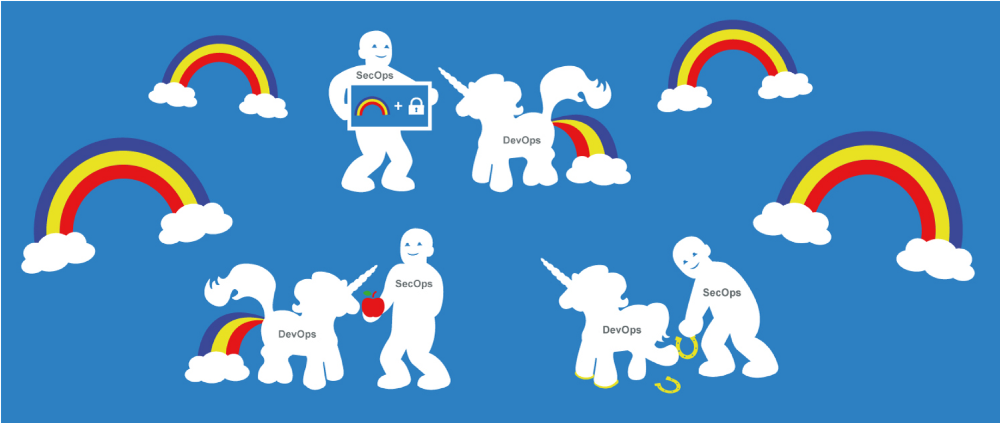
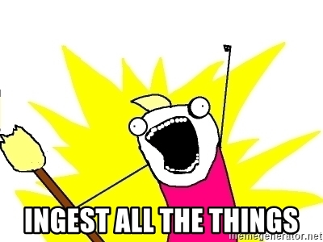

# GitOops! Attacking and defending CI/CD pipelines

**As part of our [ongoing quest](https://tech.ovoenergy.com/building-a-secure-ci-cd-pipeline-for-terraform-infrastructure-as-code/) to improve the _status quo_ of CI/CD security, we present [GitOops](https://github.com/ovotech/gitoops): a tool to map CI/CD attack paths in a GitHub organization.**

Lateral movement and privilege escalation via CI/CD pipelines is old news for those in the know. Despite this, the security community has so far invested little effort into producing literature and tooling to improve the situation.



We will start by motivating our work by presenting an overview of the issues we are trying to spot at scale. We will then gloss over GitOops' inner-workings before demonstrating usage with some sample scenarios.

## Introduction

With the proliferation of CI/CD integrations and dynamic checks in Version Control System providers, users can directly and indirectly run code in a variety of contexts by pushing changes to repositories. The most common example is running code in a CI/CD runner by triggering software test suits from a feature branch when opening a pull request.

Combined with lax access controls to repositories and their branches, this can offer easy paths for lateral movement and privilege escalation within an organization.

Here are a some common scenarios:

- The lack of production branch protections on a repository with a production continuous deployment pipeline could allow anyone with write access to the repository to deploy malicious changes to production.

- The lack of branch-based access controls for secrets in CI/CD systems like CircleCI and, historically, [GitHub Actions](https://github.blog/changelog/2020-12-15-github-actions-environments-environment-protection-rules-and-environment-secrets-beta/), means that an un-trusted (un-reviewed) feature branch may have access to production secrets when running a build in a pull request context.

- Running a Terraform production _plan_ on an untrusted (un-reviewed) feature branch may give untrusted infrastructure code and Terraform providers [access to production and production secrets](https://alex.kaskaso.li/post/terraform-plan-rce).

- An excessive number of administrators on a critical repository can increase the chances of branch protections being disabled to enable an attack via CI/CD pipelines.

As organizations grow to have thousands of repositories, hundreds of users and teams, use dozens of CI tools, and empower teams with autonomy, it is unreasonable to expect security teams to manually investigate and keep tabs on these attack paths.

## Graph DBs aren't just for hipsters


Graph databases are cool and trendy, but they can also be useful.

If we abstract a way the details from the scenarios above, what we're really looking for are relationships between GitHub:

- users
- teams
- repositories

and CI/CD:

- jobs (i.e. `deploy prod` or `tf-plan-prod`)
- environment variables (often secrets)

The relationships we are looking for are of moderate depth and can take several different forms.

An organization may use different CI/CD systems. We mostly use CircleCI, GitHub Actions and [AWS CodeBuild](https://tech.ovoenergy.com/building-a-secure-ci-cd-pipeline-for-terraform-infrastructure-as-code/), with a dash of Jenkins laying around for good ol' legacy reasons. Most CI/CD systems support user-defined environment variables, but with different twists. For example:

- CircleCI has Contexts, which are away of reusing a bundle of environment variables across projects, while also support a way of directly attaching environment variables to specific Projects (which have a one-to-one mapping with GitHub repositories)
- GitHub Actions also supports attaching environment variables diretly to repositories, but it also supports a notion of Environment (essentially, environment variables directly attached to a repositoriy but with branch protection rules) and Organization environment variables (you guessed it: available to all repositories in an organization)

These approaches are quite different. Wouldn't it be great if we could search for all paths between a user and a secret without having to worry about which system(s) we're targetting?

This sounds like a good case for a graph database. It's much more fun to write:

```
MATCH p=(:User{login:"alice"})-[*..5]->(:EnvironmentVariable)
RETURN p
```

than to try to translate all possible paths into an SQL statement.

We opted to work with Neo4j and the Cypher query language; the Community edition is free, easy to use and popular. The folks at Neo4j have also [open-sourced Cypher](https://opencypher.org/) and some [other graph databases](https://docs.aws.amazon.com/neptune/latest/userguide/access-graph-opencypher-bolt.html) have started supporting the Bolt binary protocol.

## What do we ingest?



Now that we have justified the use of a hipster's DB, what do we store exactly? We'll gloss over this here; you're welcome to check the [code](https://github.com/ovotech/gitoops) and the [schema](https://github.com/ovotech/gitoops/blob/main/docs/schema.md) for the details.

### Access Controls

We want to know:

- Relationships between users and teams within an organization.
- Repositories that users/teams can access. We're particular interested in repositories a user/team can open a pull request against (`write` access in GitHub) or have admin access on (allowing them to disable branch protections to abuse a production deployment pipeline triggered on a merge to the main branch, for example).
- Which repositories have branch protections enabled?

### CI/CD Configurations

We want to know which repositories have CI/CD configurations:

- We ingest CI/CD configuration files for popular CI/CD systems.
- For CircleCI we can query the API to figure out which repositories have a project configured.

### Events

We want to know:

- Which repositories trigger jobs on pull requests and merges to the main branch? There's a couple of ways we can get this information:
  - Repository Webhook configurations can tell us which repository events trigger a Webhook against specific CI/CD systems.
  - Status checks can tell us a lot of about which kind of jobs are run on pull requests through their name.

### Secrets

For the _pièce de résistance_, we want to know where all the secrets are:

- For GitHub Actions and CircleCI we directly query the APIs to retrieve environment variable names. For CircleCI we can even get the value of the last four characters of an environment variable!
- For other CI/CD systems, we can extract environment variables from the configuration files if they are explicitly mentioned by regex-matching upper kebab case strings. We can also look for strings that imply the presence of interesting secrets in the pipeline (e.g. `aws`, `terraform` etc.)

## Examples

Now that we've ingested relevant data from our GitHub organization and CI/CD systems, we can start mapping some attack paths. We'll only cover a sample here, you can find more examples in the [docs](https://github.com/ovotech/gitoops/blob/main/docs/examples.md).

### Finding all secrets a user can access

This query will return paths between a user and potential secrets, via several means:

- CircleCI
  - "All members" contexts (available to anyone in the organization)
  - team-restricted contexts (you guessed it, restricted to the user's teams)
  - repository projects (available to anyone with `write` access to a repository)
- GitHub Actions
  - repository (available to anyone with `write` access to a repository)
  - environment (may be restricted to pushes to specific branches)
  - organization (available to anyone in the organization)

```
MATCH p=(:User{login:"alice"})-[*..5]->(:EnvironmentVariable)
RETURN p
```

If we want support for other CI/CD systems, we could try the query below which will look for mentions of environment variables and certain keywords in configuration files:

```
MATCH p=(:User{login:"alice"})-[*..2]->(r:Repository)-[HAS_CI_CONFIGURATION]->(f:File)
WHERE any(x IN f.env WHERE x =~ ".*(AUTH|SECRET|TOKEN|PASS|PWD|CRED|KEY|PRD|PROD).*")
OR any(x IN f.tags WHERE x IN ["aws", "gcp", "terraform"])

RETURN r
```

### Attackable Terraform plans

Production Terraform plans on unreviewed code are [a bad idea](https://alex.kaskaso.li/post/terraform-plan-rce). We attempt to find these by looking at the context values on pull requests' status checks, to get maximum coverage and account for CI/CD systems that may be configured server-side (e.g. AWS CodeBuild). The funky regex in this query means "things that contain `terraform` (or `tf`) and `prod` (or `prd`, and as long as it's not preceeded by `non`):

```
MATCH (r:Repository)-[:HAS_STATUS_CHECK{pullRequest:TRUE}]->(s:StatusCheck)
WHERE s.context =~ "(?=._(tf|terraform))(?=._(?<!non)pro?d).\*"
RETURN r.name
```

### Pivoting through GitHub bots or: how I learned to stop worrying and love CircleCI

This author has yet to witness a GitHub organization of a respectable size that did not make use of one or more GitHub "bot" user account. Personal Access Tokens (PATs) for these user accounts also have a sneaky habit of finding their way into CI/CD systems.

What's more, several GitHub SDKs misleadingly give the impression that you need to provide a username when using a PAT (in reality any string will do). This has the interesting side effect of leading to `GITHUB_USERNAME` environment variables often being found next to `GITHUB_TOKEN` ones.

To throw a cherry on top, CircleCI allows you to retrieve the last four characters of environment variables through their API.

I'm sure you see where this is going: if we're lucky we can run a query to predict the access an attacker would obtain by pivoting through `GITHUB_TOKEN` environment variables, thanks to a bit of regex:

```

MATCH (u:User{login:"alice"})-[*..5]->(v:EnvironmentVariable)
WHERE v.variable =~ ".*GITHUB.*USER.\*"
WITH DISTINCT(v.truncatedValue) as truncVal

MATCH p=(u:User)-->[*..5]-->(:EnvironmentVariable)
WHERE u.login =~ "^.\*" + truncVal + "$"

RETURN p

```

If we're not so lucky, can always extract the `GITHUB_TOKEN` through a pull request and hit the [`/user` GITHUB API endpoint](https://docs.github.com/en/rest/reference/users#get-the-authenticated-user) to retrieve the authenticated user's login.

## What's next?

GitOops is currently designed for one-off mappings from a security engineer's laptop. In the future, we would like to move towards a form of continuous monitoring of an organization's GitHub security posture. Details will be fleshed out as we move along, but this may look something like:

- run a GitOops ingestion job on a continuous basis
- remove old nodes and relationships from the database (we've [anticipated this requirement](https://github.com/ovotech/gitoops/blob/main/docs/run.md#ingest-github-data) with the `-session` flag)
- monitor events and trigger alerts when a new relationship matches a known bad pattern

We would also love to formally support additional CI/CD systems and VCS providers. If you want to contribute we'd be super interested! You can hit up the author on Twitter [@\_alxk](https://twitter.com/_alxk).
